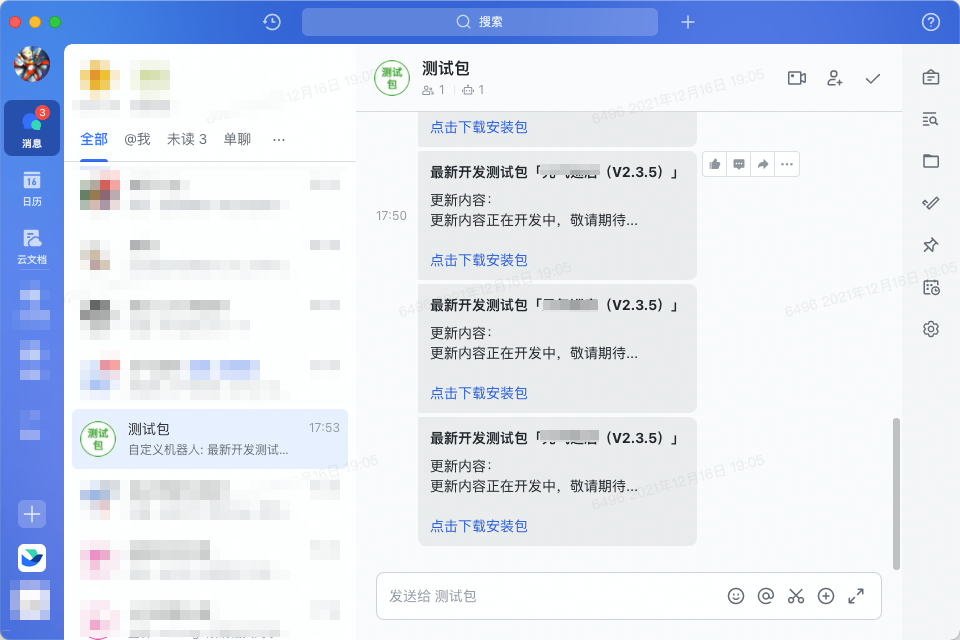

# UploadApkPlugin

## 上图

## 痛点
作为Android开发人员，我们时常遇到这样的场景，在项目开发测试阶段，经常会将`apk`打包后，上传的蒲公英第三方平台（公司用的是蒲公英，没有自己搭建Jenkins），然后再复制二维码发给飞书测试群提醒测试人员进行测试，体验。每次发包的时候都要经过几个步骤：
1. 找到`apk`文件
2. 网址中打开蒲公英网站，找到对应的拖拽二维码上传的界面
3. 将应用的`apk`文件拖拽到上传界面等待上传（网速慢的要等很长时间）
4. 点击发布，点击列表打开详情页
5. copy二维码到飞书测试工作群
6. 再发送一条本次`apk`的更新内容

从上边的步骤可以看出，每次给测试提供测试包都要经过这些痛苦的步骤，费时又费力，完完全全的人为操作。所以此插件就是为了解决上述几个问题。

## 不足

由于jcenter不在维护，导致插件只能上传到maven库里，但是由于配置问题，我的maven库一直申请失败，所以暂时用本地插件的方式，这样有个好处就是可以根据自己的业务需求随时修改代码（比如增加`Productflavors`，可以随意区分哪种flavor执行发布包）。

## 使用

1. 下载代码到本地，在自己的项目中引用`uploadPlugin`module

2. 配置根工程的build.gradle 的 `classpath 'com.eegets.plugin:upload:1.0.1'`，如下代码：
```gradle
 buildscript {

    repositories {
		...       
        maven {
            url uri("./plugin")
        }

        // gradle plugins 插件maven
        maven { url "https://plugins.gradle.org/m2/" }
    }
    dependencies {
       	 ...

        // 组件注册插件，此处的包名要和build.gradle中 'uploadArchives' 配置信息下的配置一致
        classpath 'com.eegets.plugin:upload:1.0.1'
    }
}

```
3. 根目录下创建一个名为`plugin`的文件夹
4. app目录下的`build.gradle`添加引用插件 `apply plugin: 'com.eegets.plugin'`，如下代码：
```gradle
plugins {
    id 'com.android.application'
}
/**
 * 此处的包名要和 'UploadPlugin'下'src/resources/META-INF/gradle-plugins/下的包名一致'
 */
apply plugin: 'com.eegets.plugin'

android {
   ...
}

dependencies {
	...
}
```

5. 修改`uploadPlugin`下的`PgyerUtils.java`中的参数信息，如下代码：
```java
	 private MultipartBody.Builder addRequestBody(String description) {
        if (TextUtils.isEmpty(description)) {
            description = "更新内容正在开发中，敬请期待...";
        }
        return new MultipartBody.Builder()
                .setType(MediaType.parse("multipart/form-data"))
                .addFormDataPart("_api_key", "0b9e7c7b9cf4ace8c41626f6371d2eca")
                .addFormDataPart("appKey", "9a5fcfca95c4b33d378bb746b713726e")
                .addFormDataPart("userKey", "7174de3cf30861bf6c11344996593317")
                .addFormDataPart("buildUpdateDescription", description);
    }

```

5. 修改`uploadPlugin`下的`FeishuExt.kt`中的`feishuHookUrl`参数信息，如下代码：
```kotlin
 /**
     * 飞书hook接口，可修改为自己飞书群机器人的hook地址
     */
    private const val feishuHookUrl = "https://open.feishu.cn/open-apis/bot/v2/hook/2c506f22-39e9-47c4-b9bc-4ef9bddd02e9"

```

## 运行
1. 编译运行项目，生成`Apk`文件

2. 执行任务Task
>在Android Studio的右边，tasks里面会新增一个`UploadApkPlugin/uploadPlugin/Tasks/upload/uploadArchives`任务。点击该任务，则可直接进行编译、打包、传送、发消息等一些列操作。 在执行task命令时，会打印相应日志，包括蒲公英上传情况、钉钉飞书等消息发送情况，一目了然。


## 后期优化

- 配置远程maven库「希望能审核通过」

- 蒲公英和飞书的参数配置动态配置

- 通过gitlab的Api从gitlab上拉取commitMessage提交到蒲公英提交日志中，机器人消息展示本次提交的提交修改日志，方便测试人员查看日志。

- 本地生成二维码，配置飞书后台应用，机器人消息展示二维码图片，方便测试人员扫码。
